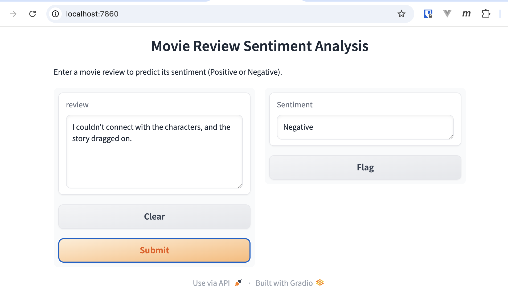

# Prerequisites

* [Git LFS](https://docs.github.com/en/repositories/working-with-files/managing-large-files/installing-git-large-file-storage)

We use it to manage large files. Anyone cloning this repo must install Git LFS first, then clone the repo.

# Sentiment Analysis on Movie Reviews

This project is about sentiment analysis on movie reviews. We fine-tune a pre-trained model on the IMDB dataset for sentiment analysis. We provide a Gradio UI for sentiment analysis.

## Setup

### Clone the repo

```sh
git clone git@github.com:Hivekind/fine-tune-model.git
```

### Install dependencies

```sh
# create python virtual env
python -m venv env

# activate the env
source env/bin/activate

# install dependencies
pip3 install -r requirements.txt
```

### Run the model via Docker

You can run the model via Docker. The model API server is running on `http://localhost:5000`.

```sh
docker compose up
```

The API endpoint is `/sentiment` and it accepts a POST request with a JSON payload:

```json
{
  "review": "This is a great movie!"
}
```

You can test the model API server using `curl`:

```sh
  curl -X POST http://localhost:5000/sentiment \
       -H "Content-Type: application/json" \
       -d '{"review": "This movie was absolutely fantastic, I loved every minute of it!"}'
```

### Run the UI via Gradio

You can run the Gradio UI for sentiment analysis. The UI is running on `http://localhost:7860`.

```sh
python sentiment_analysis.py
```

It takes a text input and returns the sentiment of the text, by sending a POST request to the model API server. The UI looks like this:




# Project Structure

## Pre-trained Model

We use the `distilbert-base-uncased` model from the Hugging Face Transformers library.

## Dataset

The dataset is the [IMDB dataset](https://huggingface.co/datasets/stanfordnlp/imdb) from the Hugging Face Datasets library. The dataset contains 50,000 movie reviews, with 25,000 reviews for training and 25,000 reviews for validation. The dataset is split into two classes: positive and negative reviews.

## Fine-tuning the model

We fine-tune the model on the IMDB dataset for sentiment analysis. The training was done on Google Colab. The fine-tuned model is saved in the `movie_sentiment_model` directory. The model is saved in the `model.safetensors` format. 

You can find the fine-tuning code [here](colab/fine_tune_imdb.ipynb).

## Running the model for sentiment analysis on Colab

After fine-tuning the model, we can run the model on Google Colab for sentiment analysis, using the Gradio UI. You can find the code [here](colab/movie_sentiment_analysis_UI.ipynb).

## Docker image for fine-tuned model

We package the fine-tuned model into a Docker image, and provide an API for sentiment analysis.

```sh
docker build -t sentiment-analysis-model .
```

## Diagram

You can find the project structure in the `diagram` directory.

- [fine-tuning](diagram/fine-tuning/fine-tuning.html)
- [dockerized-model](diagram/dockerized-model/dockerized-model.html)


# Managing Large Files with Git LFS
We use Git LFS to manage large files in this repository.

## Initial Setup
Install Git LFS:

```sh
# for macOS
brew install git-lfs

# for Ubuntu
sudo apt install git-lfs
```

Set up Git LFS to track large file:

```sh
# Initialize Git LFS
git lfs install

# Track large file
git lfs track "movie_sentiment_model/model.safetensors"

# Add and commit
git add .gitattributes
git add .
git commit -m "Track large file with Git LFS"
git push origin main
```
